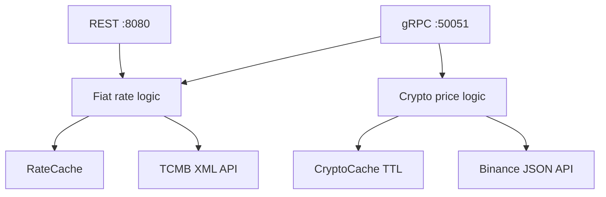

# Building the ExchangeRateService Go Microservice from Scratch

> This is not a general Go course. It is a project-specific tutorial, aligned with the real commit history, for starting with `go mod init` and rebuilding the ExchangeRateService used by WalletApp.

## How to use this guide

Follow the stages in order when you need to reconstruct the service or refresh your Go knowledge. Each stage leaves a working system: TCMB retrieval, a thread-safe cache, REST, a background worker, Docker, gRPC, cryptocurrency prices, and observability.

Commit references point to the real implementation. Files under `internal/grpc/pb/` are generated from the `.proto` contract and must not be edited manually.

## 1. Mental model of the final system



REST and gRPC share the same `RateCache` pointer. A fiat rate fetched through one protocol can be a cache hit through the other. Cryptocurrency prices use a separate expiring cache because they are volatile.

| Path | Responsibility |
| --- | --- |
| `cmd/api/main.go` | Composition root: caches, servers, routing, tracing, and lifecycle |
| `internal/rates/tcmb.go` | TCMB URLs, HTTP calls, XML parsing, and currency selection |
| `internal/rates/models.go` | TCMB XML structs |
| `internal/rates/cache.go` | Mutex-protected in-memory fiat cache |
| `internal/rates/handler.go` | REST validation and JSON responses |
| `internal/rates/scheduler.go` | Proactive 15:30 TRT cache worker |
| `internal/rates/crypto.go` | Binance client and TTL cache |
| `proto/rate.proto` | Language-independent gRPC contract |
| `internal/grpc/server.go` | gRPC method implementations |
| `internal/grpc/pb/` | Code generated by `protoc` |

---

# Stage 1 — Create the Go module and directory structure

**Corresponding commit:** `39e8179 Initial commit: Go mod and gitignore`

```bash
mkdir ExchangeRateService
cd ExchangeRateService
go mod init exchangerateservice
mkdir -p cmd/api internal/rates internal/grpc proto
touch cmd/api/main.go
git init
```

The module name becomes the import root:

```go
import "exchangerateservice/internal/rates"
```

`internal/` is enforced by Go: packages in that tree cannot be imported from outside the containing module tree. `cmd/api` contains the executable entry point.

```go
package main

import "log"

func main() {
    log.Println("Exchange Rate Service starting")
}
```

```bash
gofmt -w .
go run ./cmd/api
go build ./...
```

Package names are normally short and lowercase. Uppercase identifiers are exported to other packages; lowercase ones remain package-private.

---

# Stage 2 — Model the TCMB XML response

**Corresponding commit:** `0ccf12a tcmb xml parsing and fetch today rate logic`

Model only the fields the service consumes:

```go
package rates

import "encoding/xml"

type TcmbResponse struct {
    XMLName    xml.Name   `xml:"Tarih_Date"`
    Currencies []Currency `xml:"Currency"`
}

type Currency struct {
    Code        string `xml:"Kod,attr"`
    ForexBuying string `xml:"ForexBuying"`
}
```

`xml:"Currency"` collects repeated elements; `xml:"Kod,attr"` reads an attribute. `ForexBuying` arrives as text and is converted to `float64` later. Unmodelled XML fields are ignored.

---

# Stage 3 — Implement the TCMB HTTP client

**Corresponding commits:** `0ccf12a`, followed by date logic in `389ef49`

```go
func FetchRateByDate(targetCurrency string, date time.Time) (float64, error) {
    validDate := getValidWorkday(date)
    url := buildURL(validDate)

    resp, err := http.Get(url)
    if err != nil {
        return 0, fmt.Errorf("could not connect to TCMB: %w", err)
    }
    defer resp.Body.Close()

    if resp.StatusCode != http.StatusOK {
        return 0, fmt.Errorf("TCMB returned %d for %s", resp.StatusCode, url)
    }

    body, err := io.ReadAll(resp.Body)
    if err != nil {
        return 0, fmt.Errorf("could not read XML: %w", err)
    }

    var data TcmbResponse
    if err := xml.Unmarshal(body, &data); err != nil {
        return 0, fmt.Errorf("could not parse XML: %w", err)
    }

    for _, currency := range data.Currencies {
        if currency.Code == targetCurrency {
            rate, err := strconv.ParseFloat(currency.ForexBuying, 64)
            if err != nil {
                return 0, fmt.Errorf("currency value is not numeric: %w", err)
            }
            return rate, nil
        }
    }
    return 0, fmt.Errorf("requested currency not found: %s", targetCurrency)
}
```

Go returns a value and an `error` rather than using try/catch. `%w` preserves the underlying error chain. `defer` closes the response body on function exit, and `&data` gives the decoder a pointer it can populate.

## 3.1 TCMB URLs by date

Today uses `https://www.tcmb.gov.tr/kurlar/today.xml`; historical dates use `.../YYYYMM/DDMMYYYY.xml`.

```go
yearMonth := targetDate.Format("200601")
dayMonthYear := targetDate.Format("02012006")
```

Go formats time using the reference value `2006-01-02 15:04:05`, not tokens such as `YYYY-MM-DD`.

## 3.2 Weekend fallback

```go
func getValidWorkday(date time.Time) time.Time {
    switch date.Weekday() {
    case time.Saturday:
        return date.AddDate(0, 0, -1)
    case time.Sunday:
        return date.AddDate(0, 0, -2)
    default:
        return date
    }
}
```

The current code only moves weekends back to Friday. It does not handle public holidays or future weekdays. Despite the README wording, there is no separate invalid-future-date fallback. A hardened version may move backward after a TCMB 404, but the policy must be explicit.

---

# Stage 4 — Add a thread-safe fiat cache

**Corresponding commit:** `3e86550 thread safe in-memory cache with mutex added`

Handlers run concurrently, while a plain Go `map` is not safe for concurrent reads and writes.

```go
type RateCache struct {
    mu    sync.RWMutex
    rates map[string]float64
}

func NewRateCache() *RateCache {
    return &RateCache{rates: make(map[string]float64)}
}

func (c *RateCache) Get(key string) (float64, bool) {
    c.mu.RLock()
    defer c.mu.RUnlock()
    value, exists := c.rates[key]
    return value, exists
}

func (c *RateCache) Set(key string, value float64) {
    c.mu.Lock()
    defer c.mu.Unlock()
    c.rates[key] = value
}
```

`RWMutex` allows multiple readers and one exclusive writer. Keep the map private so all access goes through locked methods.

Normalize currencies with `strings.ToUpper(strings.TrimSpace(...))`. The fiat cache has no TTL because historical rates are treated as immutable. It is process-local and disappears on restart.

---

# Stage 5 — Expose the REST API with go-chi

**Corresponding commit:** `ca54930 REST API with go-chi and smart caching`

```bash
go get github.com/go-chi/chi/v5
```

Request: `GET /api/rates?currency=USD&date=2026-07-04`.

Example response:

```json
{
  "currency": "USD",
  "date": "2026-07-04",
  "rate": 46.6337,
  "source": "TCMB"
}
```

## 5.1 Handler dependency injection

Go does not need a DI container. Inject the shared pointer explicitly:

```go
type RateHandler struct { Cache *RateCache }

cache := rates.NewRateCache()
handler := rates.RateHandler{Cache: cache}
```

`main` is the composition root, equivalent to explicit constructor injection in .NET.

## 5.2 Handler flow

1. Read `currency` and `date`.
2. Return JSON 400 when missing or invalid.
3. Build the cache key and check memory.
4. Return `source: Cache` on a hit.
5. Fetch TCMB, cache it, and return `source: TCMB` on a miss.
6. Map upstream failure to 502.

```go
func (h *RateHandler) GetRate(w http.ResponseWriter, r *http.Request) {
    currency := strings.ToUpper(strings.TrimSpace(r.URL.Query().Get("currency")))
    dateStr := r.URL.Query().Get("date")

    if currency == "" {
        writeJSONError(w, http.StatusBadRequest, "missing currency")
        return
    }
    targetDate, err := time.Parse("2006-01-02", dateStr)
    if err != nil {
        writeJSONError(w, http.StatusBadRequest, "date must be YYYY-MM-DD")
        return
    }

    cacheKey := fmt.Sprintf("%s_%s", currency, targetDate.Format("2006-01-02"))
    if rate, exists := h.Cache.Get(cacheKey); exists {
        writeJSON(w, http.StatusOK, RateResponse{
            Currency: currency, Date: dateStr, Rate: rate, Source: "Cache",
        })
        return
    }

    rate, err := FetchRateByDate(currency, targetDate)
    if err != nil {
        writeJSONError(w, http.StatusBadGateway, err.Error())
        return
    }
    h.Cache.Set(cacheKey, rate)
    writeJSON(w, http.StatusOK, RateResponse{
        Currency: currency, Date: dateStr, Rate: rate, Source: "TCMB",
    })
}

func writeJSON(w http.ResponseWriter, status int, data any) {
    w.Header().Set("Content-Type", "application/json")
    w.WriteHeader(status)
    if err := json.NewEncoder(w).Encode(data); err != nil {
        log.Printf("encode response: %v", err)
    }
}
```

```go
r := chi.NewRouter()
r.Use(middleware.Logger)
r.Use(middleware.Recoverer)
r.Get("/api/rates", handler.GetRate)
log.Fatal(http.ListenAndServe(":8080", r))
```

`Recoverer` prevents a panic from killing the process. Normal business errors should still be returned as errors, not panics.

---

# Stage 6 — Proactive background worker and goroutine

**Corresponding commit:** `872b9fe proactive background worker with goroutine`

The worker preloads EUR and USD at 15:30 TRT:

```go
func StartProactiveCache(cache *RateCache) {
    trt := time.FixedZone("TRT", 3*60*60)
    go func() {
        for {
            now := time.Now().In(trt)
            target := nextWorkdayAt1530(now, trt)
            time.Sleep(target.Sub(now))

            fetchDate := time.Now().In(trt)
            for _, currency := range []string{"EUR", "USD"} {
                rate, err := FetchRateByDate(currency, fetchDate)
                if err != nil {
                    log.Printf("background fetch %s: %v", currency, err)
                    continue
                }
                key := fmt.Sprintf("%s_%s", currency, fetchDate.Format("2006-01-02"))
                cache.Set(key, rate)
            }
        }
    }()
}
```

The goroutine lets `main` continue starting servers, while `time.Sleep` consumes no busy-loop CPU. Production improvements include `Europe/Istanbul`, context cancellation, a timer, timeout/retry, public-holiday policy, and replica coordination.

---

# Stage 7 — Build a multi-stage Docker image

**Corresponding commit:** `5a61853 Dockerfile for minimal alpine deployment`

```dockerfile
FROM golang:1.26-alpine AS builder
WORKDIR /app
COPY go.mod go.sum ./
RUN go mod download
COPY . .
RUN CGO_ENABLED=0 GOOS=linux go build -o /app/exchange-api ./cmd/api

FROM alpine:latest
WORKDIR /app
RUN apk --no-cache add tzdata ca-certificates
COPY --from=builder /app/exchange-api .
EXPOSE 8080 50051
ENTRYPOINT ["./exchange-api"]
```

`CGO_ENABLED=0` helps create a static binary. Copying module files first preserves Docker's dependency cache. The current Dockerfile exposes only 8080; gRPC port 50051 must also be made reachable in Docker/Coolify. `EXPOSE` itself is only metadata.

---

# Stage 8 — Add gRPC and the Protobuf contract

**Corresponding commit:** `b9e540d gRPC server alongside REST API`

Keep REST for simple debugging while .NET uses a typed gRPC client.

## 8.1 Required tools

```bash
go get google.golang.org/grpc
go get google.golang.org/protobuf
go install google.golang.org/protobuf/cmd/protoc-gen-go@latest
go install google.golang.org/grpc/cmd/protoc-gen-go-grpc@latest
export PATH="$PATH:$(go env GOPATH)/bin"
```

Install the `protoc` compiler separately.

## 8.2 Proto contract

```protobuf
syntax = "proto3";
package rates;
option go_package = "./internal/grpc/pb";

service ExchangeRateService {
  rpc GetExchangeRate (RateRequest) returns (RateResponse);
  rpc GetCryptoRate (CryptoRequest) returns (CryptoResponse);
}

message RateRequest {
  string currency = 1;
  string date = 2;
}

message RateResponse {
  string currency = 1;
  string date = 2;
  double rate = 3;
  string source = 4;
}
```

Field numbers identify fields on the wire. Never reuse a published number for a different meaning; reserve removed numbers.

```bash
protoc --go_out=. --go-grpc_out=. proto/rate.proto
```

Never edit generated `.pb.go` files manually. Regenerate them when the contract changes; .NET must use the same contract.

## 8.3 Server implementation

```go
type GrpcServer struct {
    pb.UnimplementedExchangeRateServiceServer
    Cache       *rates.RateCache
    CryptoCache *rates.CryptoCache
}
```

Embed the unimplemented server for forward compatibility and inject the same fiat cache used by REST. Prefer meaningful gRPC status codes such as `InvalidArgument` and `Unavailable` over generic `fmt.Errorf` responses.

## 8.4 Two servers in one process

Run gRPC in a goroutine on 50051 and REST on the main goroutine on 8080. This works, but coordinated error handling and graceful shutdown make the lifecycle safer.

---

# Stage 9 — Binance cryptocurrency prices and TTL cache

**Corresponding commit:** `0271f17 Binance API + 5-minute TTL caching via gRPC`

Cryptocurrency prices require expiration:

```go
type CryptoCacheItem struct {
    Price     float64
    ExpiresAt time.Time
}

type CryptoCache struct {
    mu    sync.RWMutex
    items map[string]CryptoCacheItem
}

func (c *CryptoCache) Get(symbol string) (float64, bool) {
    c.mu.RLock()
    defer c.mu.RUnlock()
    item, exists := c.items[symbol]
    if !exists || time.Now().After(item.ExpiresAt) {
        return 0, false
    }
    return item.Price, true
}
```

An idiomatic setter accepts `time.Duration`, called as `5*time.Minute`. Binance returns price as a string, parsed with `strconv.ParseFloat`. Use a shared timed `http.Client`, context, and symbol normalization/validation. Expired entries currently remain in the map; unbounded symbols require cleanup or eviction.

The upstream response can be modeled with:

```go
type BinanceResponse struct {
    Symbol string `json:"symbol"`
    Price  string `json:"price"`
}

var httpClient = &http.Client{Timeout: 5 * time.Second}
```

Prefer `http.NewRequestWithContext` and `httpClient.Do` over global `http.Get`. This lets a canceled .NET request cancel the downstream Binance call as well.

---

# Stage 10 — Correlation-ID metadata logging

**Corresponding commit:** `8170747 metadata extraction to log correlation IDs`

```go
func logWithCorrelation(ctx context.Context, format string, args ...any) {
    correlationID := "unknown"
    if md, ok := metadata.FromIncomingContext(ctx); ok {
        if values := md.Get("x-correlation-id"); len(values) > 0 {
            correlationID = values[0]
        }
    }
    log.Printf("[%s] %s", correlationID, fmt.Sprintf(format, args...))
}
```

This joins .NET and Go logs for one request. gRPC metadata keys should be lowercase. The current REST path lacks correlation propagation; add Chi middleware if dual-protocol consistency is needed.

---

# Stage 11 — OpenTelemetry distributed tracing

**Corresponding commits:** `5891e96 OpenTelemetry tracer + gRPC stats handler`; fix `3b685cc traceparent header fix`

Initialize an OTLP exporter, resource name `FamilyFinance.ExchangeRate`, batch processor, global tracer provider, and W3C TraceContext propagator:

```go
func initTracer(ctx context.Context) (*sdktrace.TracerProvider, error) {
    endpoint := os.Getenv("OTLP_ENDPOINT")
    if endpoint == "" {
        endpoint = "localhost:4317"
    }

    exporter, err := otlptracegrpc.New(ctx,
        otlptracegrpc.WithEndpoint(endpoint),
        otlptracegrpc.WithInsecure(),
    )
    if err != nil {
        return nil, err
    }

    res, err := resource.Merge(
        resource.Default(),
        resource.NewWithAttributes(
            semconv.SchemaURL,
            semconv.ServiceName("FamilyFinance.ExchangeRate"),
        ),
    )
    if err != nil {
        return nil, err
    }

    provider := sdktrace.NewTracerProvider(
        sdktrace.WithBatcher(exporter),
        sdktrace.WithResource(res),
    )
    otel.SetTracerProvider(provider)
    otel.SetTextMapPropagator(propagation.TraceContext{})
    return provider, nil
}
```

Instrument the server:

```go
grpcServer := grpc.NewServer(
    grpc.StatsHandler(otelgrpc.NewServerHandler()),
)
```

This connects the incoming Go span to the .NET trace. Instrument outgoing TCMB/Binance calls with `otelhttp` so they appear as child spans. Call `provider.Shutdown` with a timeout to flush buffered spans. `WithInsecure()` is appropriate only for a trusted internal plaintext OTLP connection.

---

# Stage 12 — Assemble the `main.go` composition root

`main` wires dependencies rather than containing business logic:

1. Root context and signal handling.
2. OpenTelemetry provider.
3. Fiat and crypto caches.
4. Proactive worker.
5. gRPC listener/server/service.
6. REST handler using the same cache pointer.
7. Chi routes and middleware.
8. Both servers.
9. Coordinated shutdown.

Use `signal.NotifyContext`, an error channel, `http.Server.Shutdown`, and `grpcServer.GracefulStop`. The README mentions channels, but the current code does not use one; coordinated server error handling provides a real use case.

```go
ctx, stop := signal.NotifyContext(context.Background(), os.Interrupt, syscall.SIGTERM)
defer stop()

httpServer := &http.Server{
    Addr:              ":8080",
    Handler:           router,
    ReadHeaderTimeout: 5 * time.Second,
}

errCh := make(chan error, 2)
go func() { errCh <- grpcServer.Serve(grpcListener) }()
go func() { errCh <- httpServer.ListenAndServe() }()

select {
case <-ctx.Done():
case err := <-errCh:
    log.Printf("server stopped: %v", err)
}

shutdownCtx, cancel := context.WithTimeout(context.Background(), 10*time.Second)
defer cancel()
grpcServer.GracefulStop()
_ = httpServer.Shutdown(shutdownCtx)
```

---

# Stage 13 — Add tests

**Current state:** The supplied repository and history contain no test files. This is the first quality step after reproducing current behavior.

```bash
go test ./...
go test -race ./...
go test -cover ./...
```

## 13.1 Pure date tests

Use table-driven cases for Saturday, Sunday, and weekdays. Inject `now` or a clock so URL tests remain deterministic.

```go
func TestGetValidWorkday(t *testing.T) {
    tests := []struct {
        name string
        in   string
        want string
    }{
        {"Saturday goes to Friday", "2026-07-04", "2026-07-03"},
        {"Sunday goes to Friday", "2026-07-05", "2026-07-03"},
        {"Monday remains Monday", "2026-07-06", "2026-07-06"},
    }

    for _, tt := range tests {
        t.Run(tt.name, func(t *testing.T) {
            input, _ := time.Parse("2006-01-02", tt.in)
            got := getValidWorkday(input).Format("2006-01-02")
            if got != tt.want {
                t.Fatalf("got %s, want %s", got, tt.want)
            }
        })
    }
}
```

## 13.2 Cache concurrency tests

Run many goroutines performing `Get` and `Set`, then use the race detector. The absence of a race matters as much as the final value.

## 13.3 TCMB/Binance HTTP tests

Inject the base URL or HTTP client and use `httptest.NewServer` for success, upstream errors, malformed payload, unknown currencies, timeout, and cancellation.

## 13.4 REST handler tests

Use `httptest.NewRecorder` and `httptest.NewRequest` for missing query, invalid date, cache hit, and upstream failure.

## 13.5 gRPC integration tests

Use `bufconn` instead of a TCP port. Call through the generated client and verify status codes and shared-cache behavior.

---

# Stage 14 — Reliability and production hardening

## 14.1 HTTP timeout and connection reuse

Use one shared `http.Client`, deadlines, and request contexts.

## 14.2 Cache stampede

A mutex protects the map, not the external fetch. `singleflight.Group` can merge simultaneous misses for one key into one TCMB request.

## 14.3 Input validation

Validate supported currencies, crypto symbols, dates, future-date policy, and archive range. Use `net/url` for queries.

## 14.4 Monetary precision

`float64` is practical for rates but unsafe for exact ledger totals. Consider scaled integers, decimal libraries, or string/minor-unit Protobuf fields when exact money arithmetic is required.

## 14.5 Multiple replicas

RAM caches and schedulers are process-local. Accept that at small scale, or introduce Redis and scheduler coordination when necessary.

## 14.6 Health endpoints

Separate liveness and readiness. Avoid calling TCMB/Binance on every probe; last-success timestamps are often better signals.

## 14.7 Security and network boundary

Keep gRPC internal. Public exposure needs TLS, authentication/authorization, rate limits, and request-size limits. Never expose plaintext OTLP publicly.

---

# Stage 15 — Recommended CI/CD quality gate

The repository currently has no workflow. A practical pipeline is:

```yaml
name: Go CI
on:
  push:
    branches: [main]
    paths-ignore:
      - "**/*.md"

jobs:
  test:
    runs-on: ubuntu-latest
    steps:
      - uses: actions/checkout@v4
      - uses: actions/setup-go@v5
        with:
          go-version: "1.26.x"
          cache: true
      - run: go mod download
      - run: gofmt -w . && git diff --exit-code
      - run: go vet ./...
      - run: go test -race -cover ./...
      - run: go build ./...
      - run: docker build -t exchange-rate-service .
```

Deployment should happen only after every check passes. In CI, `gofmt -w` is followed by `git diff --exit-code` so formatting differences fail the job rather than being silently committed.

---

# Stage 16 — End-to-end reconstruction checklist

## Core Go service

- [ ] Module and directory structure created.
- [ ] TCMB XML tags and HTTP error handling correct.
- [ ] Today/archive URLs and weekend fallback work.
- [ ] Currency input normalized and validated.

## Cache and REST

- [ ] `RateCache` protected by `sync.RWMutex`.
- [ ] Cache key contains currency and effective date.
- [ ] Chi middleware and routes configured.
- [ ] Invalid input returns 400; TCMB failure returns 502.

## Background and container

- [ ] Worker runs at 15:30 Istanbul time and survives failures.
- [ ] Worker supports context cancellation.
- [ ] Multi-stage image contains timezone and CA data.
- [ ] Ports 8080 and 50051 are reachable as intended.

## gRPC and cryptocurrency

- [ ] Proto contract is the source of truth.
- [ ] Generated files are never edited.
- [ ] REST and gRPC share one fiat-cache pointer.
- [ ] gRPC returns meaningful status codes.
- [ ] Binance uses timeout/context and crypto uses five-minute TTL.

## Observability and quality

- [ ] Correlation propagates through gRPC and REST.
- [ ] OpenTelemetry links Go to the .NET trace.
- [ ] Outgoing HTTP calls are instrumented.
- [ ] Tracer and servers shut down gracefully.
- [ ] Date, cache, HTTP, handler, and gRPC tests pass under `-race`.
- [ ] CI enforces format, vet, test, build, and image build.

---

# Stage 17 — Feature and file inventory

| Feature | Entry point | Business/data code |
| --- | --- | --- |
| Fiat REST | `RateHandler.GetRate` | `tcmb.go`, `cache.go` |
| Fiat gRPC | `GrpcServer.GetExchangeRate` | `tcmb.go`, `cache.go` |
| Crypto gRPC | `GrpcServer.GetCryptoRate` | `crypto.go` |
| Proactive cache | `StartProactiveCache` | `scheduler.go`, `tcmb.go`, `cache.go` |
| Protobuf | `proto/rate.proto` | Generated `internal/grpc/pb` |
| Correlation | Incoming gRPC context | `internal/grpc/server.go` |
| Tracing | gRPC stats handler | `cmd/api/main.go` |
| Deployment | Container entry point | `Dockerfile` |

---

# Stage 18 — Short Go glossary

**Module:** Dependency and import root defined by `go.mod`.  
**Package:** Go files compiled together in one directory.  
**`internal`:** Package tree protected from outside imports.  
**Exported identifier:** Uppercase name visible from other packages.  
**Pointer (`*T`):** Refers to the same object rather than copying it.  
**Receiver:** The `(c *RateCache)` part binding a method to a type.  
**Goroutine:** Lightweight concurrent task managed by Go.  
**Channel:** Typed communication path between goroutines.  
**RWMutex:** Allows multiple readers and one exclusive writer.  
**`defer`:** Schedules a call for function exit.  
**`context.Context`:** Carries deadline, cancellation, and request metadata.  
**Race detector:** Finds concurrent-memory bugs with `go test -race`.  
**TTL:** Period during which a cache entry is valid.  
**Singleflight:** Deduplicates concurrent work for one key.  
**Protobuf:** Language-independent schema and binary serialization.  
**gRPC:** RPC communication based on Protobuf.  
**OTLP:** Protocol for exporting OpenTelemetry data.

---

# Appendix A — The development story in the real commit history

1. `39e8179`: Go module and repository shell.
2. `0ccf12a`: TCMB XML parsing and today's rate.
3. `3e86550`: Mutex-protected cache.
4. `389ef49`: Historical dates and weekend logic.
5. `ca54930`: Chi REST endpoint and cache-aside flow.
6. `872b9fe`: 15:30 proactive-cache goroutine.
7. `5a61853`: Minimal Alpine Docker deployment.
8. `97ed702`, `a693655`: Documentation.
9. `b9e540d`: gRPC and Protobuf alongside REST.
10. `0271f17`: Binance and five-minute TTL cache.
11. `8170747`: Correlation metadata logging.
12. `5891e96`: OpenTelemetry and gRPC instrumentation.
13. `3b685cc`: Trace propagation fix.
14. `5fe5334`: Final README update.

This is also a natural Go learning sequence: standard-library HTTP/XML first, then concurrency safety, transport layers, and distributed-system observability.

# Appendix B — Template for adding a provider

1. Define the provider contract.
2. Inject the HTTP client and base URL for testing.
3. Map responses to a common domain result.
4. Add normalization and provider validation.
5. Define cache key and TTL policy.
6. Evaluate singleflight.
7. Pass context, timeout, and cancellation.
8. Map failures to HTTP/gRPC status at the boundary.
9. Propagate correlation and trace context.
10. Add unit, handler, and integration tests.
11. Supply configuration and secrets through the environment.
12. Update health behavior, metrics, and deployment ports.

Final thought: the instructive part of this service is not Go syntax. TCMB and Binance clients fetch data, caches accelerate access, REST and gRPC handle transport, and `main` joins them through shared pointers and a coordinated lifecycle. Once those boundaries are clear, you can rebuild the service without memorizing it.
